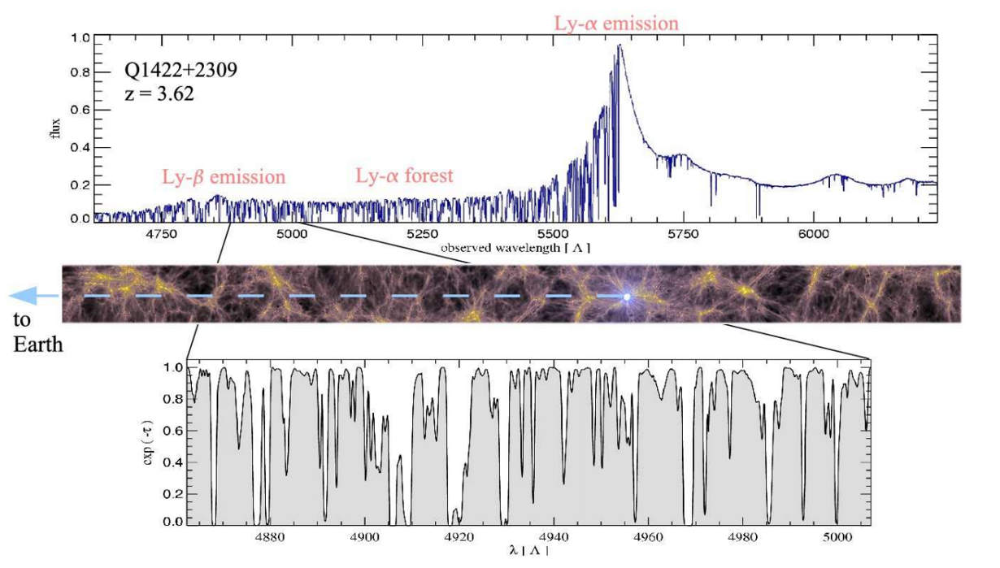
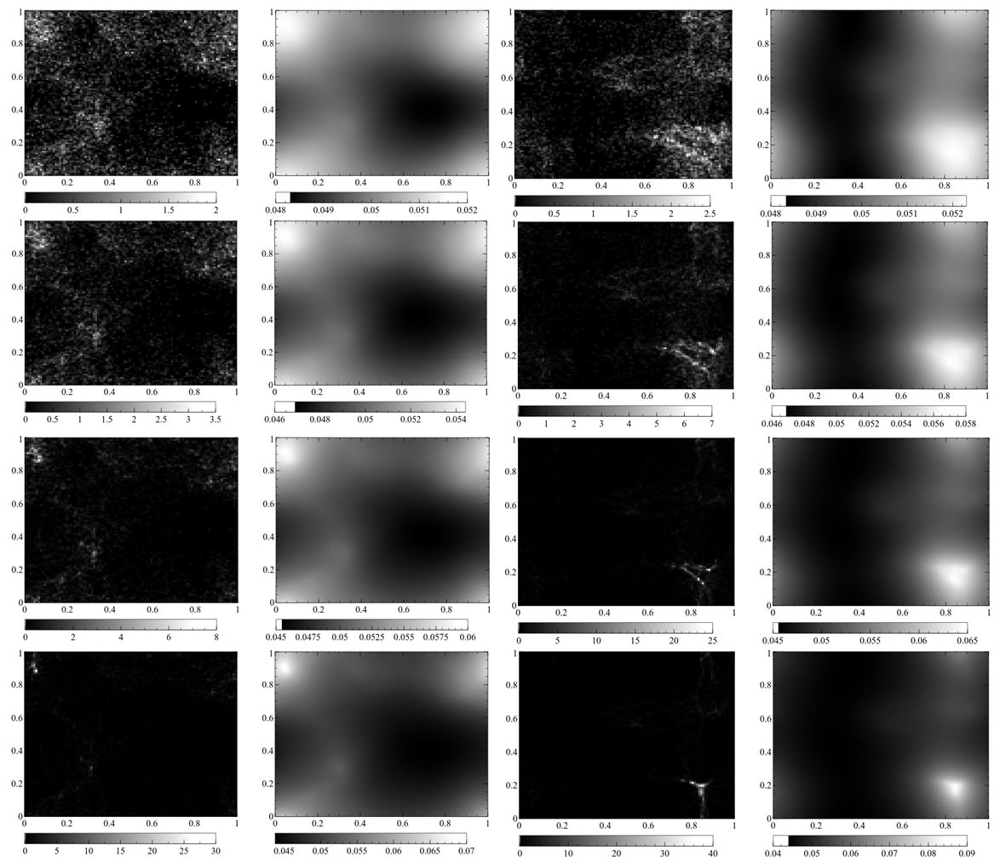
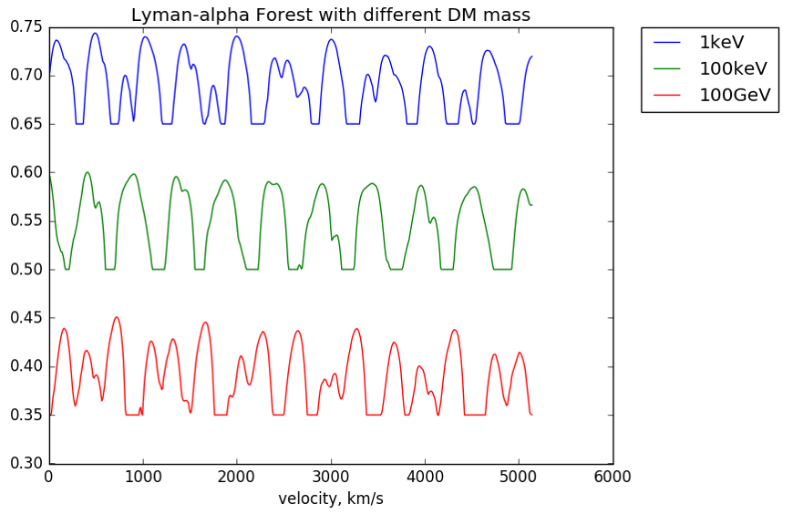

# Constraints on Dark Matter Mass from Lyman-α forest

This is a julia code repository for Computational Cosmology final project, Winter 2016. 

## Summary

We use Eulerian N-body hydrodynamics simulations to study the evolution of warm dark matter models. We 
compare the artificial Lyman-alpha spectra depending on the mass of the dark
matter particles and check whether there really appears difference in small
scale features of the spectra. We argue that careful comparison of the actual
observation and simulation can give us a lower bound on the dark matter mass.
 
 
More details of the work can be found in [final report](report.pdf)

|  |
|:--:| 
| The sample numerical simulation of dark matter and ordinary matter(baryon) distribution.|

From top to bottom, we show how dark matter and ordinary matter distribution evolves in time 
by gravity and hydrodynamical pressure. 
The left two columns are for `mass = 100 GeV` (cold dark matter), and the right two columns 
are for `mass = 100 keV` (warm dark matter). For each mass, images in the left column show the evolution of
dark matter distributions, and those in the right column show the evolution of ordinary matter. From
the top to bottom, the corresponding redshifts are `z = 11.42, 6.83, 4.97, 3.92` (high `z` means more in the past).
Note that although ordinary matter started with uniform distribution, they quickly fall into the
potential well of dark matter. |

|  |
|:--:| 
| The simulated Lyman-alpha forest spectra |

## Note
It is built upon the original `[NoName](https://github.com/yipihey/NoName)` repository 
by [Tom Abel](http://tomabel.org/) which provides an environment for exploring various 
algorithms in computational cosmology. Please refer to original `[ReadMe](ReadMeNoName.md)` or 
`[NoName](https://github.com/yipihey/NoName)` repository for further details of the original code.

